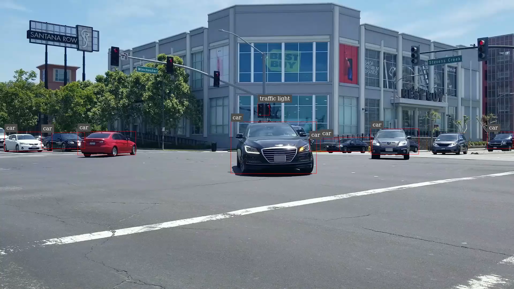

# ------------------------------------------------------
# This sample application is no longer maintained
# ------------------------------------------------------

# Deploying an open source model using NVIDIA DeepStream and Triton Inference Server

This repository contains contains the the code and configuration files required to deploy sample open source models video analytics using Triton Inference Server and DeepStream SDK 5.0.

## Getting Started ##

### Prerequisites: ###

[DeepStream SDK 5.0](https://developer.nvidia.com/deepstream-sdk) or use docker image  (nvcr.io/nvidia/deepstream:5.0.1-20.09-triton) for x86 and (nvcr.io/nvidia/deepstream-l4t:5.0-20.07-samples) for NVIDIA Jetson.

The following models have been deployed on DeepStream using Triton Inference Server.

For further details, please see each project's README.

### TensorFlow Faster RCNN Inception V2 : [README](faster_rcnn_inception_v2/README.md) ###
  The project shows how to deploy [TensorFlow Faster RCNN Inception V2 network trained on MSCOCO dataset](https://github.com/tensorflow/models/blob/master/research/object_detection/g3doc/tf1_detection_zoo.md) for object detection.
  

### ONNX CenterFace : [README](centerface/README.md) ###
  The project shows how to deploy [ONNX CenterFace](https://github.com/Star-Clouds/CenterFace) network for face detection and alignment.
  
  
Additional resources:

Developer blog: [Building Intelligent Video Analytics Apps Using NVIDIA DeepStream 5.0](https://developer.nvidia.com/blog/building-iva-apps-using-deepstream-5-0-updated-for-ga/)

Learn more about [Triton Inference Server](https://developer.nvidia.com/nvidia-triton-inference-server)

Post your questions or feedback in the [DeepStream SDK developer forums](https://forums.developer.nvidia.com/c/accelerated-computing/intelligent-video-analytics/deepstream-sdk/15)
