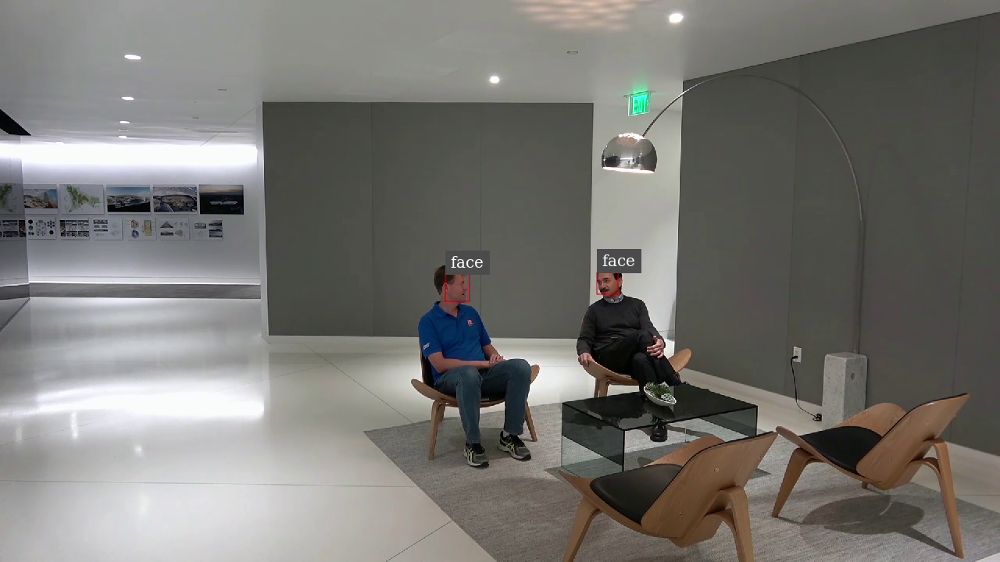

# ONNX Centerface Model with Deepstream #

  

We are using Deepstream-5.0 with Triton Inference Server to deploy the Centerface network for face detection and alignment. For more information about the network please read : (https://arxiv.org/ftp/arxiv/papers/1911/1911.03599.pdf). This example shows a step by step process to deploy the Centerface network. 

Currently ONNX on Triton Inference Server with DeepStream is supported only on x86.

---

### Prerequisites: ###

[DeepStream SDK 5.0](https://developer.nvidia.com/deepstream-sdk)

Download and install DeepStream SDK or use DeepStream docker image(nvcr.io/nvidia/deepstream:5.0.1-20.09-triton).

Follow the instructions mentioned in the quick start guide: (https://docs.nvidia.com/metropolis/deepstream/dev-guide/index.html#page/DeepStream_Development_Guide/deepstream_quick_start.html)

### Running the model with DeepStream ###

`cd centerface/1 && ./run.sh`
 
* centernet_labels.txt: This is the label file for centerface network. There is only one label, "face". If you are using a different model with different classes then you will have to update this file.

* config.pbtxt: This is a model configuration file that provides the information about the model. This file must specify the name, platform, max_batch_size, input, output. To get more information on this file please check: (https://docs.nvidia.com/deeplearning/triton-inference-server/user-guide/docs/model_configuration.html)

* 1/change_dim.py: In Triton Inference Server, if you want the input and output nodes to have variable size then relevant dimensions should be specified as -1. change_dim.py reads the input ONNX model, updates the height and width dimensions to -1, and saves the resulting model. 

* 1/run.sh: This script downloads the model and updates the dimension of input and output nodes.

## Custom Parser ##

`cd customparser`

In the custom parser, we take the outputlayer, apply the post-processing algorithm, and then attach the bounding boxes to NvDsInferObjectDetectionInfo. For more information on NvDsInferObjectDetectionInfo please check (https://docs.nvidia.com/metropolis/deepstream/4.0/dev-guide/DeepStream_Development_Guide/baggage/nvdsinfer_8h_source.html#l00126)

If you need to update the custom parser for your own model then you can update customparserbbox_centernet.cpp and rebuilt it with 'make'. 

## Deepstream Configuration Files ##

There are two configuration file:
1. Inference configuration file
	* Sets the parameters for inference. This file takes the model configuration file sets the parameters for pre/post-processing
2. Application configuration file
	* Sets the configuration group to create a DeepStream pipeline. In this file you can set different configuration groups like source, sink, primary-gie, osd etc. Each group is calling a gstreamer-plugin. For more information on these plugins and configuration please check (https://docs.nvidia.com/metropolis/deepstream/plugin-manual/index.html#page/DeepStream%20Plugins%20Development%20Guide/deepstream_plugin_details.html) (https://docs.nvidia.com/metropolis/deepstream/dev-guide/index.html)

These files are located at centerface/config 
## Run the Application ##

To run the application:

`cd centerface/config`

`deepstream-app -c source1_primary_detector.txt`

## Performance ##
| Model | WxH | Perf. | Hardware | # Streams | # Batch Size |
| ------ | ------ | ------ | ------ | ------ | ------ |
| Centerface | 640x480 | 136 fps | T4 | 20 | 20 | 

## FAQ ##
Getting an error related to model dimensions (failed to load 'CenterNet' version 1: Invalid argument: model 'CenterNet', tensor 'input.1': the model expects 4 dimensions (shape [10,3,32,32]) but the model configuration specifies 4 dimensions (shape [1,3,480,640]))

Answer: Please make sure you have updated the input node dimensions to -1 as mentioned in the pre-processing step and are using the correct ONNX model. 
 

